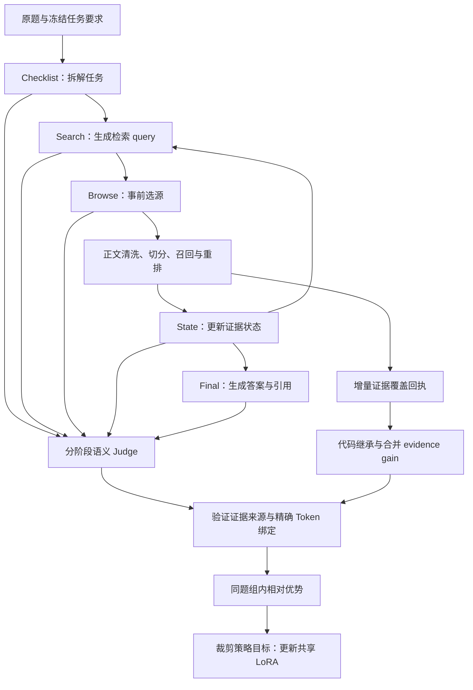

# 医学研究智能体｜Qwen3-8B SFT 与分阶段稠密奖励 GRPO

面向本地部署的医学 Research Agent：基于 Qwen3-8B，自主调用 Search/Browse 工具，检索医学证据、更新任务状态，并生成带来源引用的回答；通过 QLoRA SFT 和分阶段稠密奖励进行 GRPO 风格后训练。

项目重点不是给模型接一个检索接口，而是研究：**如何让真实工具轨迹中的检索、选源、证据判断和最终回答分别获得学习信号。**

## 为什么不只奖励最终答案

只看最终答案总分时，很难区分“检索词有效”“选错来源”“证据判断错误”和“答案引用不支持主张”。本项目保留最终任务收益，同时拆分过程奖励，将不同通道的优势绑定到实际生成的 Token 范围。

| 算法设计 | 解决的问题 |
|---|---|
| 分阶段信用分配 | Checklist、Search、Browse、State、Final 分别评价，而非所有动作只接收同一个总分 |
| 选源与证据收益分离 | Browse 评价打开前的选源质量；代码根据打开后的 coverage 回执计算 evidence gain |
| 增量证据继承 | 保留上一步可信证据状态，评价新证据增量，避免无关新材料抹掉已确认支持 |
| 精确 Token 归因 | 评分绑定真实 record/capture，再编译到对应生成跨度，不按“附近 Token”猜测归属 |
| 组内相对优势 | 同题多条 rollout 按冻结配置计算 advantage，使用 clipped objective 更新共享 LoRA |

以上是已实现的设计，不代表已通过消融实验证明优于 final-only 奖励。

## 系统架构



## 真实轨迹案例

急性冠脉综合征后的秋水仙素研究问题，来自服务器实际 SFT 推理记录：

```text
英文医学原题
→ Checklist：拆成疗效与治疗限制性不良反应两个要求
→ Search：检索相关论文
→ Browse：打开 S2 论文来源，读取带完整 ID 的正文片段
→ State：模型将两个要求均标记为 direct
→ FINAL_READY
→ Final：四段英文答案，生成四个句后 citation
```

本例实际执行 **1 次 Search、1 次 Browse**，没有补造第二轮检索。[查看真实原始输出、工具动作与引用](examples/trajectory_demo/README.md)。这是过程案例，不是标准答案：State 是模型自报状态，治疗限制性不良反应是否充分回答仍需原文审核。本例未调用 Judge，奖励字段保留为 null。

## 已验证的范围

| 内容 | 当前证据与边界 |
|---|---|
| 真实工具轨迹 | 独立服务器实验执行真实 Search/Browse，并保存生成 capture 与工具执行记录 |
| 分阶段 Judge | 一题四轨迹的阶段评分完成；合法 schema 不等于语义判断一定正确 |
| 增量 evidence gain | 四轨迹、8 个 Browse 的收益评分通过，实际 6 次 API 请求、6 次缓存命中 |
| 奖励编译与绑定 | 可信 authority 与 batch preflight 通过，共编译 42 条通道记录 |
| 行为概率一致性 | 同一工程验收的 replay 最大差值约为 7.39×10⁻⁶ |
| 真实 LoRA 更新 | 一题四轨迹执行 1 次 optimizer.step；504 个权重张量改变，checkpoint 完整性通过，原适配器不变 |
| 无模型离线检查 | 250 项核心合同回归检查；另有 Python 3.10 / 3.11 / 3.12 CI |
| 大规模 RL 效果 | 尚未完成；不报告未经验证的提升百分比 |

表中工程验收与上面的 SFT 案例是不同运行，不能把工程验收奖励归到该案例。

## 训练路线

SFT 学习工具协议和多步轨迹；RL 使用真实工具采集结果及局部奖励继续更新同一共享 LoRA。模型权重不合并为新的完整模型后再重复叠加适配器；具体加载与概率校验见[训练说明](docs/training.md)。

训练与集成验证运行于新加坡 NSCC GPU 集群，兼顾单卡 QLoRA 与本地推理部署。当前已验收的 RL 参数更新是单 GPU 实验；共享阶段上下文上限为 **8192 tokens（输入＋预留输出）**，Final 单次输出上限为 **2400 tokens**。

```text
固定当前策略 → 采集多条真实轨迹 → 分阶段 Judge → 独立语义复核
            → 可信奖励编译 → 概率与绑定校验 → LoRA 训练 → 留出集对照
```

计划以 50 题、每题 4 条 rollout（共 200 条轨迹）为一个采集与评分周期。复核纠正需要保留原响应、审核依据和版本化回执，不能直接改 batch 分数。

**一个采集周期不等于一次 optimizer.step。** 当前 trainer 按题组更新；如果希望 50 题累积后只执行一次更新，还需要实现并验证跨题梯度累积、归一化和保存语义。

## 检索与证据处理

工具后端接入 PubMed/PMC、Semantic Scholar 与网页检索；正文经过 HTML/XML 解析、通用模板噪声过滤和多语言边界切分，再进行 BM25/BGE 召回与 MiniLM 重排。

Browse 返回完整 chunk ID 与正文，State 保存 requirement 对应的 evidence IDs，Final 自己生成正文及句后 `<cite>`。代码检查格式与 ID，Judge 判断语义支持；不会自动替模型补上引用。详见[检索说明](docs/retrieval.md)。

## 核心模块

| 模块 | 实现内容 |
|---|---|
| 模型与后训练 | Qwen3-8B 接口，completion-only QLoRA SFT，共享 LoRA RL trainer |
| 检索与证据 | HTML/XML 解析、通用模板噪声过滤、多语言切分边界、BM25/BGE 召回与 MiniLM 重排 |
| Agent 协议 | Checklist 原题锚点、预算化候选预览、State evidence IDs、Final citation 解析 |
| Judge | Checklist、Search、Browse、State，以及 Final completeness / fidelity / citation |
| 任务收益 | 增量证据覆盖、工具成本、可信 policy event 与可评价的主动 Stop |
| 训练完整性 | 可信 authority、真实 capture/token 绑定、整题组 pending gate、原子 checkpoint |

公开版包含算法模块、工具后端、训练器、真实轨迹摘录与离线测试；模型权重、私有题集、完整 capture、密钥和集群专用脚本不随代码发布。

## 零 GPU、零 API Key 演示

Python 3.10+ 即可运行：

```bash
python -B run_pipeline.py demo
python -B run_pipeline.py check
```

演示用明确标记的合成四轨迹 fixture 调用**实际 reward compiler**，验证正负 advantage 和增量证据继承。不会加载模型、请求 Judge 或更新参数；fixture token IDs 不代表真实模型 capture。

离线检查覆盖奖励、authority、证据回执、Judge schema 与整组放行规则。

## 代码结构

```text
agent/          模型可见协议、citation 与 token 工具
retrieval/      工具后端、正文解析与片段选择
sft/            completion-only QLoRA 数据准备与训练
judge/          评分计划、schema 验证与维度聚合
shared/         不可变回执、evidence gain 与严格缓存
training/       reward compiler、advantage、clipped loss 与 replay
orchestrator/   可移植身份、token scope 与执行工具
examples/       真实静态轨迹案例与无密钥离线验证
docs/           中文架构、算法与训练说明
```

按功能定位当前源码，请看[代码阅读导航](docs/code_navigation.md)。GPU 训练依赖与输入准备见[训练说明](docs/training.md)。

## 当前研究边界

已完成有限范围的真实采集、评分、奖励编译与参数更新闭环；大规模 RL 效果和 Judge 语义稳定性仍在评测。离线合同测试、工具成功和流程完成分别证明不同层面的工程行为，完整效果需要留出集对照与独立证据审核。

## 阅读导航

| 文档 | 内容 |
|---|---|
| [系统架构](docs/architecture.md) | 工具轨迹、证据流与可信训练边界 |
| [奖励算法](docs/rewards.md) | 局部奖励、evidence gain、优势与归因 |
| [检索与正文处理](docs/retrieval.md) | 正文清洗、切分、召回、重排与证据坐标 |
| [SFT 与 RL 训练](docs/training.md) | 模型加载、LoRA、行为概率 replay 与更新 |
| [评测与独立复核](docs/evaluation.md) | 对照实验、Judge 审计与结果使用边界 |
| [代码阅读导航](docs/code_navigation.md) | 当前入口、版本模块依赖与推荐阅读顺序 |

## 开源与使用边界

Apache-2.0；复用代码的必要署名见[第三方声明](THIRD_PARTY_NOTICES.md)。模型和外部服务另受各自条款约束。许可证原文与必要版权声明保留。

本项目用于研究，不作为医疗决策系统。
