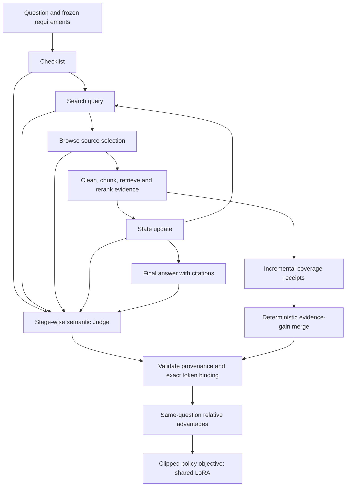

# Local Dense GRPO Agent

A local-first research implementation of evidence-grounded agents with **stage-wise dense rewards**, immutable evidence receipts, and GRPO-style LoRA post-training.

The agent learns more than whether its final answer is good: which query it generated, which source it opened, how it updated evidence state, and what it actually cited are separately evaluated and attributed to generated token spans.

## Architecture



## What is included

| Component | Implementation |
|---|---|
| Backbone and adaptation | Qwen3-8B integration contracts; completion-only QLoRA SFT; shared-adapter RL trainer |
| Retrieval | HTML/XML parsing, generic template filtering, multilingual chunk boundaries, BM25 + BGE retrieval, MiniLM reranking |
| Agent protocol | Checklist anchors, bounded source previews, State evidence IDs, Final citation parsing |
| Judge | Checklist, Search, Browse, State, Final completeness/fidelity/citation; frozen scorer identity |
| Task credit | Incremental evidence coverage, tool costs, verified policy events and eligible voluntary Stop |
| Training safety | Authority-backed receipts, captured-token bindings, whole-group pending gates and atomic checkpoints |

This is a modular research source release, not a turnkey hosted application. Model weights, private question sets, captured user data, provider keys, cluster scripts and experiment logs are intentionally excluded.

## Run without a GPU or API key

Python 3.10+ is sufficient for the synthetic reward-compiler demo and core checks:

```bash
python -B run_pipeline.py demo
python -B run_pipeline.py check
```

The demo runs the **actual reward compiler** on a synthetic four-rollout fixture, then exercises incremental evidence inheritance. It performs no model inference, external Judge request or parameter update. Synthetic token IDs are not claimed to be real model captures.

## Source map

```text
agent/          model-visible protocols and citation/token utilities
retrieval/      tool backend, document parser and passage selection
sft/            completion-only QLoRA preparation and training
judge/          pure score planning, schema validation and aggregation
shared/         immutable receipts, evidence-gain contracts and cache
training/       reward compiler, relative advantages, clipped loss, replay
orchestrator/   portable identity, token-scope and execution utilities
examples/       zero-key synthetic demonstration
docs/           architecture, rewards, retrieval and training workflow
```

GPU training requires a Linux/WSL environment, a compatible CUDA PyTorch installation, additional dependencies, your own data, and correctly bound capture/authority artifacts. See [training](docs/training.md); installing dependencies alone does not create an authorized training batch.

## Verification and scope

A separate integration experiment has exercised one question, four rollouts and one real LoRA optimizer update with checkpoint integrity checks. That validates a narrow engineering path; it does **not** establish improved clinical correctness, reliable Judge semantics, broad benchmark gains, or production readiness. The public checks are reproducible offline structural/regression tests, not a substitute for semantic auditing.

The planned workflow is collect → Judge → independent audit → compile → train → held-out evaluation. A 50-question collection batch means 200 rollouts at four per question; it is not automatically one optimizer step. Collection-batch size and optimizer accumulation must be configured separately.

Read [architecture](docs/architecture.md), [reward design](docs/rewards.md), [retrieval](docs/retrieval.md), [training](docs/training.md), and [evaluation](docs/evaluation.md). [中文说明](docs/README_zh.md).

## License and acknowledgments

Apache-2.0. This release contains adapted third-party agent/tool code. Existing notices are retained; see [third-party notices](THIRD_PARTY_NOTICES.md). Model weights and external services have their own terms. Research use only; not a medical decision system.
