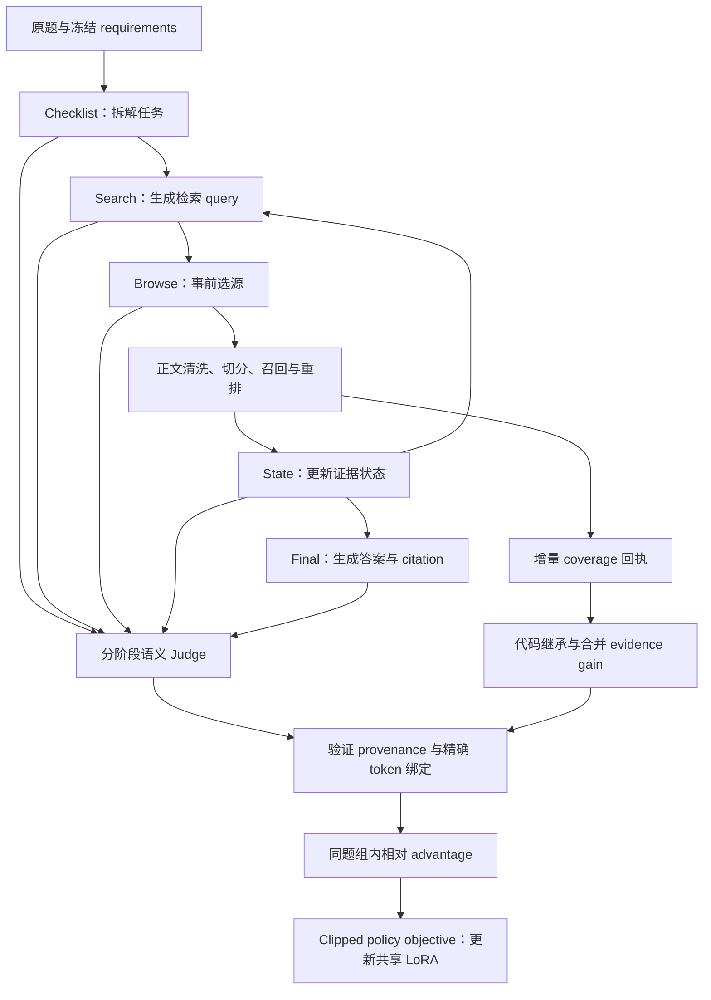

# Local Dense GRPO Agent｜本地友好的稠密奖励检索智能体

基于 Qwen3-8B 构建证据驱动的医学 Research Agent，通过**分阶段稠密奖励、不可变证据回执与 GRPO 风格 LoRA 后训练**，学习自主检索、选源、更新证据状态和生成引用式回答。

训练不只看最终答案总分：Search query、Browse 选源、State 判断和 Final 的实际引用分别评价，再将可信训练信号绑定到对应生成 Token。

## 系统架构



## 核心内容

| 模块 | 实现内容 |
|---|---|
| 模型与后训练 | Qwen3-8B 接口，completion-only QLoRA SFT，共享 LoRA RL trainer |
| 检索与证据 | HTML/XML 解析、通用模板噪声过滤、多语言切分边界、BM25/BGE 召回与 MiniLM 重排 |
| Agent 协议 | Checklist 原题锚点、预算化候选预览、State evidence IDs、Final citation 解析 |
| Judge | Checklist、Search、Browse、State，以及 Final completeness / fidelity / citation |
| 任务收益 | 增量证据覆盖、工具成本、可信 policy event 与可评价的主动 Stop |
| 训练完整性 | 可信 authority、真实 capture/token 绑定、整题组 pending gate、原子 checkpoint |

这是一份模块化研究代码发布，不是安装后即可运行的完整托管服务。模型权重、私有题集、真实 capture、密钥、集群脚本和实验运行日志不包含在公开仓库中。

## 零 GPU、零 API Key 演示

Python 3.10+ 即可运行：

```bash
python -B run_pipeline.py demo
python -B run_pipeline.py check
```

演示用明确标记的合成四轨迹 fixture 调用**实际 reward compiler**，验证正负 advantage 和增量证据继承。不会加载模型、请求 Judge 或更新参数；fixture token IDs 不代表真实模型 capture。

离线检查包含奖励、authority、证据回执、Judge schema 与整组放行规则的回归测试。它们不能替代真实语义审核。

## 代码结构

```text
agent/          模型可见协议、citation 与 token 工具
retrieval/      工具后端、正文解析与片段选择
sft/            completion-only QLoRA 数据准备与训练
judge/          评分计划、schema 验证与维度聚合
shared/         不可变回执、evidence gain 与严格缓存
training/       reward compiler、advantage、clipped loss 与 replay
orchestrator/   可移植身份、token scope 与执行工具
examples/       无密钥离线演示
docs/           中文架构、算法与训练说明
```

GPU 训练需要 Linux/WSL、兼容的 CUDA PyTorch、额外依赖、自有模型与数据，以及正确绑定的 capture / authority。详见[训练说明](docs/training.md)；安装依赖并不会自动创建获准训练的 batch。

## 验证范围与后续训练

独立服务器集成实验已打通一题四轨迹、一次真实 LoRA 更新及 checkpoint 完整性验收。这证明了有限范围的工程闭环，不代表已经证明整体回答质量、Judge 语义稳定性、广泛 benchmark 提升或生产可用性。

后续流程：采集 → Judge → 独立复核 → reward 编译 → 训练 → 留出集对照。计划每个采集周期采用 50 题、每题 4 条 rollout，即 200 条轨迹。

**采集 50 题不等于一次 optimizer.step。** 当前 trainer 按题组更新；跨题 macro-update 需要另外配置并验证梯度累积、归一化和保存语义。

阅读[架构](docs/architecture.md)、[奖励算法](docs/rewards.md)、[检索](docs/retrieval.md)、[训练](docs/training.md)和[评测与复核](docs/evaluation.md)。

## 开源与使用边界

Apache-2.0；复用代码的必要署名见[第三方声明](THIRD_PARTY_NOTICES.md)。模型和外部服务另受各自条款约束。许可证原文与必要版权声明保留。

本项目用于研究，不作为医疗决策系统。
