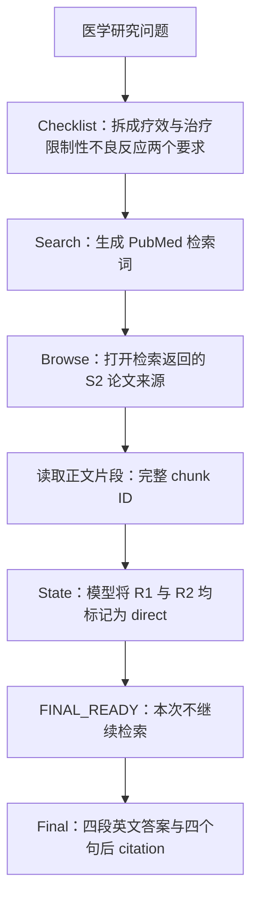

# 真实轨迹案例：急性冠脉综合征后的秋水仙素研究问题

这是 2026-09-17 服务器 Raw/SFT 两题对照中，**第一题 SFT 的真实推理记录摘录**，不是人工编写的成功轨迹。运行使用 Qwen3-8B 原始 backbone 与 V4.2 SFT LoRA，执行了真实检索工具，未调用 Judge、未进行 RL 更新。

公开摘录移除了服务器路径、进程号与部署信息；模型生成的英文文本、论文标识与 citation 保持原样。题目是医学研究问题，不包含患者信息。这里发布的是静态过程展示，不是完整 capture、可复现网络快照或获准训练的 batch。

## 一分钟看懂这条轨迹

原题：急性冠脉综合征后，在标准治疗基础上加入秋水仙素，是否减少复发心血管事件？导致无法继续治疗的不良反应有多频繁？



本例实际是 **1 次 Search、1 次 Browse**，没有第二轮检索。不能为了展示复杂流程而补造不存在的步骤。State 的 `direct` 是 Agent 自报状态，不是独立 Judge 的验证结论。

## 实际记录

| 文件 | 内容 |
|---|---|
| [question.md](question.md) | 原始英文题目及中文阅读说明 |
| [checklist.json](checklist.json) | 模型输出的任务原文锚点 |
| [search.json](search.json) | 实际 Search 决策，工具执行约 4.95 秒 |
| [browse.json](browse.json) | 实际 Browse 决策，工具执行约 9.21 秒 |
| [evidence_state.json](evidence_state.json) | 模型生成的 requirement → evidence ID 映射 |
| [final_answer.md](final_answer.md) | 模型原始最终输出，未人工补引用或改写结论 |
| [reward_breakdown.json](reward_breakdown.json) | 尚未评分的奖励项目，数值均为 null |
| [provenance.json](provenance.json) | 原日志记录的生成文本 SHA-256 与展示边界 |

Search 决策原文中的 `pubmed_search` 是工具路由；Browse 打开的具体来源 ID 是 `S2:80588d8bcdffa05dc5c1abd6e368aa8cf6a662cf`，不能将它改写成未观察到的 PMID。

## 这个例子展示了什么

模型将题目拆解为两个要求，生成合法工具动作，完成检索、正文读取与 State 更新，随后主动进入 Final，并输出包含完整 chunk ID 的引用式答案。

Final 原始输出节选（仅供研究展示，保留模型原文；完整文本见 `final_answer.md` 的源码视图）：

```xml
In patients with acute coronary syndrome, adding colchicine to standard medical therapy reduced major adverse cardiovascular events, stroke, recurrent ACS events, and hospitalizations compared with no colchicine. <cite id="S2:80588d8bcdffa05dc5c1abd6e368aa8cf6a662cf#s0-c1">ACS colchicine meta-analysis</cite>

Colchicine was associated with more gastrointestinal effects than no colchicine, with an OR of 1.16 (95% CI 1.02–1.32). <cite id="S2:80588d8bcdffa05dc5c1abd6e368aa8cf6a662cf#s0-c1">ACS colchicine meta-analysis</cite>
```

静态摘录未包含完整候选列表或原始 chunk 正文，因此 `browse.json` 只记录实际观察到的来源与引用 ID，不伪造证据片段，也不声明列出的 ID 是工具返回的全部 chunks。

## 待核对的回答缺口

原题要求的是**导致停药或无法继续治疗的不良反应频率**，模型回答提供的是一般胃肠道不良反应的 OR。两者不是同一个终点，OR 也不是绝对发生率。需要回看原文，确认是否存在对应停药数据，再评估 R2 的覆盖程度及 Final 完整性。

因此，本例展示真实 Agent 行为与可追溯引用，不将“流程完成”等同于“全部要求正确回答”。没有把这一未经评分的轨迹的奖励编造成 0.85/0.90，也没有把缺失评分当成 0。

本例模型输出仅用于算法研究展示，不作为医疗建议。
